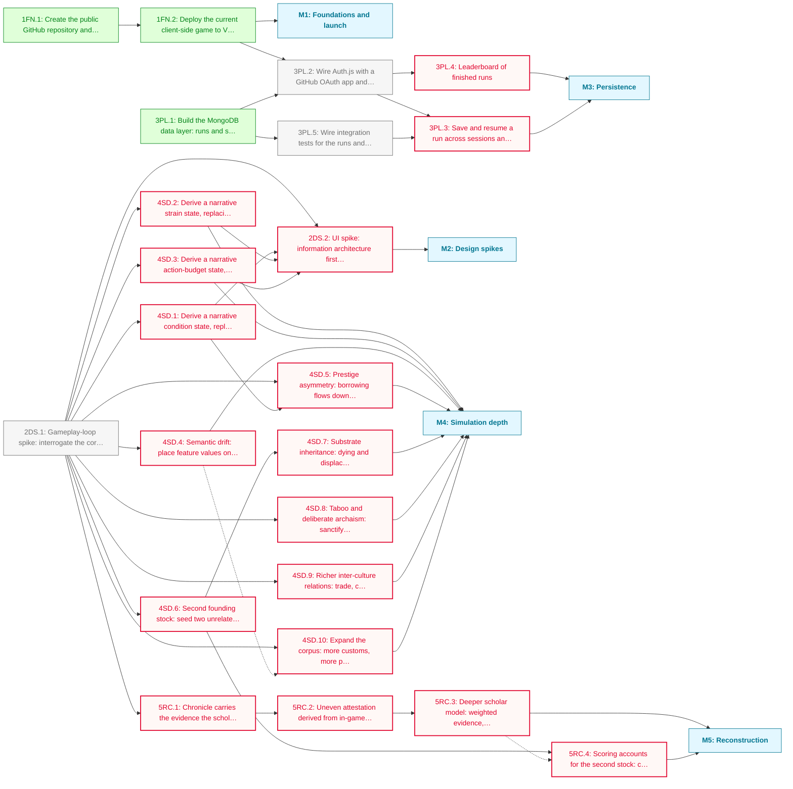

# Urheimat PHASE_1 Roadmap

Urheimat is playable but private, shallow in places, and built on a loop nobody has yet interrogated. This phase does three things at once: gets it onto a public URL, answers the open design questions before building further on them, and deepens the simulation and reconstruction models that the game's whole argument rests on.

**Critical path:** `2DS.1 → 4SD.1 → 2DS.2`; the gameplay-loop spike gates every simulation and reconstruction task, and the UI spike cannot start until state derivation is settled. The launch and persistence work runs parallel to all of it.

---

## Milestone 1: Foundations and launch

**Goal:** Get the game as it stands onto a public URL, so every later change ships somewhere real.

- [x] **1FN.1**: Create the public GitHub repository and push the existing history
  - Note: https://github.com/JasonWarrenUK/urheimat
- [x] **1FN.2**: Deploy the current client-side game to Vercel from the repository
  - Note: https://urheimat.vercel.app/

---

## Milestone 2: Design spikes

**Goal:** Answer the open design questions before building on assumptions that may not survive them.

- [ ] **2DS.1**: Gameplay-loop spike: interrogate the core premise, victory conditions, action economy and pacing, evaluate the six existing mechanics (Hold, Reform, Teach, Consolidate, Daughter band, Migrate), and define how condition, strain and action-budget states are derived
  - Note: Everything is open, including whether eight eras of three actions ending in a reconstruction is the right shape at all. Output is a design decision plus new tasks for whatever it finds wanting.
- [ ] **2DS.2**: UI spike: information architecture first, then visual design; defines how the derived states are displayed, and produces concrete mobile and accessibility tasks rather than principles _(blocked: depends on 2DS.1, 4SD.1, 4SD.2, 4SD.3)_
  - Note: Absorbs the former standalone mobile and accessibility objectives. Gated on state derivation because it cannot design the display of states whose derivation is unsettled. The canvas map currently has no keyboard or screen-reader path; that gap must leave this spike as real tasks.

---

## Milestone 3: Persistence

**Goal:** Runs survive the session and finished runs are comparable, attributed to a signed-in player.

- [x] **3PL.1**: Build the MongoDB data layer: runs and scores collections with their document shapes and access helpers
  - Note: Document shapes are already declared as RunDocument and ScoreDocument in src/lib/types.ts; the driver and adapter are installed.
- [ ] **3PL.2**: Wire Auth.js with a GitHub OAuth app and enforce document ownership in the server routes _(depends on 1FN.2, 3PL.1)_
  - Note: Depends on the deploy for the live callback URL. MongoDB has no row-level security, so ownership checks live in the SvelteKit server routes rather than the database. Also provisions the Atlas cluster the live deploy needs for the OAuth callback URL.
- [ ] **3PL.3**: Save and resume a run across sessions and devices _(blocked: depends on 3PL.2, 3PL.5)_
  - Note: The serialised state shape needs a schema version: GameState will keep changing through the simulation-depth milestone, and old saved runs must not break on load.
- [ ] **3PL.4**: Leaderboard of finished runs _(blocked: depends on 3PL.2)_
  - Note: Deliberately not a first-class feature; a small indexed collection is enough.
- [ ] **3PL.5**: Wire integration tests for the runs and scores access helpers in src/lib/server/, against the compose.yaml instance from 3PL.1 (or mongodb-memory-server if that proves less friction in CI) _(depends on 3PL.1)_
  - Note: The data layer ships with pure-function tests only; the connection and CRUD helpers are exercised by a manual smoke test, not committed. This closes that gap before 3PL.3 builds save/resume on top of them.

---

## Milestone 4: Simulation depth

**Goal:** Deepen the drift model and inter-culture dynamics so reconstruction has something harder to work on.

- [ ] **4SD.1**: Derive a narrative condition state, replacing numeric prosperity entirely _(blocked: depends on 2DS.1)_
  - Note: No float, no bar. Prosperity currently drives death at zero and the daughter-band threshold, so the derivation must preserve those mechanics while the player only ever sees prose.
- [ ] **4SD.2**: Derive a narrative strain state, replacing the count of straining parts _(blocked: depends on 2DS.1)_
- [ ] **4SD.3**: Derive a narrative action-budget state, replacing the actions-left counter _(blocked: depends on 2DS.1)_
- [ ] **4SD.4**: Semantic drift: place feature values on a similarity graph so drift favours near neighbours _(blocked: depends on 2DS.1)_
  - Note: Sky to Storm should be likelier than Sky to Sea. This also lets the scholars reconstruct a plausible intermediate rather than only a right or wrong value.
- [ ] **4SD.5**: Prestige asymmetry: borrowing flows down the prestige gradient rather than symmetrically by contact weight _(blocked: depends on 2DS.1, 4SD.1)_
  - Note: Creates the areal-feature trap: unrelated neighbours converging because they all copied the same prosperous culture. Depends on condition state because prestige is derived from it.
- [ ] **4SD.6**: Second founding stock: seed two unrelated ancestral cultures at game start _(blocked: depends on 2DS.1)_
  - Note: The player still leads a band from one stock and is still scored on recovering that stock's truth; the second exists to contaminate the record.
- [ ] **4SD.7**: Substrate inheritance: dying and displaced cultures leave traces in whoever succeeds them _(blocked: depends on 4SD.6)_
  - Note: Needs a second lineage to inherit from, so it follows the second founding stock. Traces may be unrelated traditions or mutated sibling ones.
- [ ] **4SD.8**: Taboo and deliberate archaism: sanctify a custom against drift, or revive one already lost _(blocked: depends on 2DS.1)_
  - Note: A second lever beyond Hold, and a systematic bias for the scholars to fall for.
- [ ] **4SD.9**: Richer inter-culture relations: trade, conquest and hostility beyond distance-and-terrain contact _(blocked: depends on 2DS.1)_
- [ ] **4SD.10**: Expand the corpus: more customs, more parts per custom, more values per part _(blocked: depends on 2DS.1)_
  - Note: Content work. Soft-linked to semantic drift because new values are best authored once the similarity graph exists to place them on.

---

## Milestone 5: Reconstruction

**Goal:** Make the scholars fallible in ways that reward how the player played, not just what survived.

- [ ] **5RC.1**: Chronicle carries the evidence the scholars later consume _(blocked: depends on 2DS.1)_
  - Note: Attestation has to be sourced from something recorded. The chronicle is what the player actually saw happen, which keeps the scoring legible in hindsight.
- [ ] **5RC.2**: Uneven attestation derived from in-game events, never from a random roll _(blocked: depends on 5RC.1)_
  - Note: A culture that kept Carved stones, held a long stable period or sat in broad contact leaves more for the scholars. Makes being legible to the future a goal in itself.
- [ ] **5RC.3**: Deeper scholar model: weighted evidence, competing hypotheses and sub-grouping rather than flat comparison _(blocked: depends on 5RC.2)_
- [ ] **5RC.4**: Scoring accounts for the second stock: contamination misleads, but the player's own ancestral truth stays the target _(blocked: depends on 4SD.6)_
  - Note: False unity across the two stocks becomes a scoreable error. Soft-linked to the scholar model, which it should reflect but need not wait for.

---

## Dependency Diagram

