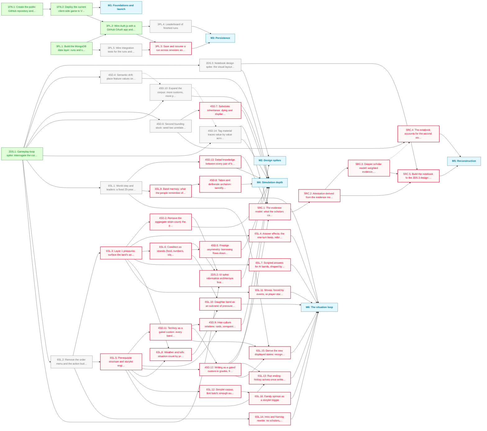

# Urheimat PHASE_1 Roadmap

Urheimat is playable but private and shallow in places, and the gameplay-loop spike has now replaced the loop it was built on. This phase does three things at once: gets it onto a public URL, answers the open design questions before building further on them, and rebuilds the loop and deepens the simulation and reconstruction models that the game's whole argument rests on.

**Critical path:** `2DS.1 → 6SL.2 → 6SL.3 → 6SL.6 → 2DS.2`; the gameplay-loop spike reported on 2026-09-30 and its decisions live in `docs/spikes/2DS.1-gameplay-loop.md`. The situation loop (Milestone 6) now gates the simulation, reconstruction and UI work, and the UI spike cannot start until condition is derived. The launch and persistence work runs parallel to all of it.

---

## Milestone 1: Foundations and launch

**Goal:** Get the game as it stands onto a public URL, so every later change ships somewhere real.

- [x] **1FN.1**: Create the public GitHub repository and push the existing history
  - Note: https://github.com/JasonWarrenUK/urheimat
- [x] **1FN.2**: Deploy the current client-side game to Vercel from the repository _(depends on 1FN.1)_
  - Note: https://urheimat.vercel.app/

---

## Milestone 2: Design spikes

**Goal:** Answer the open design questions before building on assumptions that may not survive them.

- [x] **2DS.1**: Gameplay-loop spike: interrogate the core premise, victory conditions, action economy and pacing, evaluate the six existing mechanics (Hold, Reform, Teach, Consolidate, Daughter band, Migrate), and define how condition, strain and action-budget states are derived
  - Note: Everything is open, including whether eight eras of three actions ending in a reconstruction is the right shape at all. Output is a design decision plus new tasks for whatever it finds wanting.
- [ ] **2DS.2**: UI spike: information architecture first, then visual design; defines how the derived states are displayed, and produces concrete mobile and accessibility tasks rather than principles _(blocked: depends on 2DS.1, 4SD.2, 6SL.6)_
  - Note: Absorbs the former standalone mobile and accessibility objectives. Gated on state derivation because it cannot design the display of states whose derivation is unsettled. The canvas map currently has no keyboard or screen-reader path; that gap must leave this spike as real tasks. After 2DS.1: also designs the display of the new derived states (recognition; settledness and writing as hidden custom categories; leader and generation), the granularity of the notebook's believed/true toggle, the timelapse after band death and what a watched lull shows. Decided in the 2DS.1 spike (docs/spikes/2DS.1-gameplay-loop.md, decisions 2j, 2u, 3t, 5d).
- [ ] **2DS.3**: Notebook design spike: the visual layout, mechanical behaviour and prose structure of the scholars' notebook _(depends on 2DS.1)_
  - Note: Prose only, no totals. Works from the subjects table in the spike log, combined or spread as the design finds best; settles how the believed/true toggle works and how a band that died early reads. Decided in the 2DS.1 spike (docs/spikes/2DS.1-gameplay-loop.md, decisions 2b, 2c, 2e, 2g, 2j).

---

## Milestone 3: Persistence

**Goal:** Runs survive the session and finished runs are comparable, attributed to a signed-in player.

- [x] **3PL.1**: Build the MongoDB data layer: runs and scores collections with their document shapes and access helpers
  - Note: Document shapes are already declared as RunDocument and ScoreDocument in src/lib/types.ts; the driver and adapter are installed.
- [x] **3PL.2**: Wire Auth.js with a GitHub OAuth app and enforce document ownership in the server routes _(depends on 1FN.2, 3PL.1)_
  - Note: Depends on the deploy for the live callback URL. MongoDB has no row-level security, so ownership checks live in the SvelteKit server routes rather than the database. Also provisions the Atlas cluster the live deploy needs for the OAuth callback URL. Verified live on 2026-09-18: GitHub OAuth round trip writes user, account and session; /api/runs returns 401 anonymous and only the signed-in player's own runs otherwise, excluding another player's run and an ownerless document.
- [ ] **3PL.3**: Save and resume a run across sessions and devices _(blocked: depends on 3PL.2, 3PL.5)_
  - Note: The serialised state shape needs a schema version: GameState will keep changing through the simulation-depth milestone, and old saved runs must not break on load. Scope line set when 3PL.2 landed: that task shipped the auth mechanism, the requirePlayerId ownership guard and GET /api/runs. The save POST, the delete route and the client-side resume wiring all belong here.
- [ ] **3PL.4**: Leaderboard of finished runs _(depends on 3PL.2)_
  - Note: Deliberately not a first-class feature; a small indexed collection is enough.
- [ ] **3PL.5**: Wire integration tests for the runs and scores access helpers in src/lib/server/, against the compose.yaml instance from 3PL.1 (or mongodb-memory-server if that proves less friction in CI) _(depends on 3PL.1)_
  - Note: The data layer ships with pure-function tests only; the connection and CRUD helpers are exercised by a manual smoke test, not committed. This closes that gap before 3PL.3 builds save/resume on top of them.

---

## Milestone 4: Simulation depth

**Goal:** Deepen the drift model and inter-culture dynamics so reconstruction has something harder to work on.

- [ ] **4SD.2**: Remove the aggregate strain count; the per-custom fit line is all that remains _(blocked: depends on 6SL.3)_
  - Note: Strain is per custom only, and pressures are simply the situations of the turn. Decided in the 2DS.1 spike (docs/spikes/2DS.1-gameplay-loop.md, decisions 5b).
- [ ] **4SD.4**: Semantic drift: place feature values on a similarity graph so drift favours near neighbours _(depends on 2DS.1)_
  - Note: Sky to Storm should be likelier than Sky to Sea. This also lets the scholars reconstruct a plausible intermediate rather than only a right or wrong value.
- [ ] **4SD.5**: Prestige asymmetry: borrowing flows down the prestige gradient rather than symmetrically by contact weight _(blocked: depends on 6SL.6)_
  - Note: Creates the areal-feature trap: unrelated neighbours converging because they all copied the same prosperous culture. Prestige reads the standing strand of condition (6SL.6). Decided in the 2DS.1 spike (docs/spikes/2DS.1-gameplay-loop.md, decisions 5e).
- [ ] **4SD.6**: Second founding stock: seed two unrelated ancestral cultures at game start _(depends on 2DS.1)_
  - Note: The player's line still descends from one stock; the second exists to contaminate the record and to make a mistaken origin possible (spike decision 2i).
- [ ] **4SD.7**: Substrate inheritance: dying and displaced cultures leave traces in whoever succeeds them _(blocked: depends on 4SD.6)_
  - Note: Needs a second lineage to inherit from, so it follows the second founding stock. Traces may be unrelated traditions or mutated sibling ones.
- [ ] **4SD.8**: Taboo and deliberate archaism: sanctify a custom against drift, or revive one already lost _(blocked: depends on 6SL.9)_
  - Note: Decides whether sanctifying exists and how it costs; the spike log holds a think-through of its impact under a loop with no random drift. Revival draws on the spirit's complete memory against the band's fading one. Decided in the 2DS.1 spike (docs/spikes/2DS.1-gameplay-loop.md, decisions 4f, 1g).
- [ ] **4SD.9**: Inter-culture relations: raids, conquest and absorption, and peaceful relations (trade, alliance, marriage), some player-started _(blocked: depends on 4SD.11, 6SL.5)_
  - Note: Possible actions are defined by both parties' custom and development, and evolve with them. Absorption ends the player's run when the lineage no longer holds authority; the rule for which band absorbs which must be transparent, and an equal merger needs a ruling. Decided in the 2DS.1 spike (docs/spikes/2DS.1-gameplay-loop.md, decisions 2t, 4j, 4l).
- [ ] **4SD.10**: Expand the corpus: more customs, more parts per custom, more values per part _(depends on 2DS.1)_
  - Note: Content work. Soft-linked to semantic drift because new values are best authored once the similarity graph exists to place them on.
- [ ] **4SD.11**: Territory as a gated custom: every band starts as a wandering point and keeps a seat; settling, expanding and abandoning land _(blocked: depends on 6SL.5)_
  - Note: The seat tile sets fit and strain exactly as now; claimed tiles affect only contact, ownership and crowding. Settle and expand can be player-started; abandoning land arises from situations (environment, raids by non-settled bands). Move costs by settledness are tuned here. Decided in the 2DS.1 spike (docs/spikes/2DS.1-gameplay-loop.md, decisions 3k, 3v, 4h, 4j).
- [ ] **4SD.12**: Writing as a gated custom in grades, from tallies to full record _(blocked: depends on 6SL.5, 4SD.11)_
  - Note: A settled band reaches it sooner. Each grade fixes more of what the band knows into the record; early writing does not mean a full record. Decided in the 2DS.1 spike (docs/spikes/2DS.1-gameplay-loop.md, decisions 2n, 3j).
- [ ] **4SD.13**: Dated knowledge between every pair of bands, with recognition by graded resemblance _(blocked: depends on 6SL.1)_
  - Note: What each band knows of every other and when it learnt it. A close match to a dated record is taken for the same people, a partial match for kin, a poor match for strangers; a better match across all records corrects an earlier identification. Provenance must be robust enough for the scholars to spot paradoxes and the truth toggle to explain them. Decided in the 2DS.1 spike (docs/spikes/2DS.1-gameplay-loop.md, decisions 2k, 2s, 2v, 2w).
- [ ] **4SD.14**: Tag material traces value by value across the corpus _(depends on 2DS.1)_
  - Note: Some values of a custom leave remains and others do not; the category level is too coarse. Decided in the 2DS.1 spike (docs/spikes/2DS.1-gameplay-loop.md, decisions 2l).

---

## Milestone 5: Reconstruction

**Goal:** Make the scholars fallible in ways that reward how the player played, not just what survived.

- [ ] **5RC.1**: The evidence model: what the scholars can draw on, band by band _(blocked: depends on 4SD.12, 4SD.13, 4SD.14)_
  - Note: The scholars know the end state perfectly and cannot converse with anyone. For a vanished band they have material remains, others' writing about it, its own writing and tales among other peoples. The chronicle is one record among several. Decided in the 2DS.1 spike (docs/spikes/2DS.1-gameplay-loop.md, decisions 2o, 2p, 2q).
- [ ] **5RC.2**: Attestation derived from the evidence model, band by band and value by value, never from a random roll _(blocked: depends on 5RC.1)_
  - Note: A band that kept carved stones, held a long stable period or sat in broad contact leaves more for the scholars. Decided in the 2DS.1 spike (docs/spikes/2DS.1-gameplay-loop.md, decisions 2q).
- [ ] **5RC.3**: Deeper scholar model: weighted evidence, competing hypotheses and sub-grouping rather than flat comparison _(blocked: depends on 5RC.2)_
- [ ] **5RC.4**: The notebook accounts for the second stock: contamination misleads, and a band can be given the wrong origin entirely _(blocked: depends on 4SD.6)_
  - Note: False unity across the two stocks, and false separation within one, are both readings the scholars can reach. Soft-linked to the scholar model, which it should reflect but need not wait for.
- [ ] **5RC.5**: Build the notebook to the 2DS.3 design: prose only, the subjects table, the believed/true toggle _(blocked: depends on 2DS.3, 5RC.2, 5RC.3)_
  - Note: A band can be given a wrong origin entirely; bands that died early are treated by the evidence they left. Decided in the 2DS.1 spike (docs/spikes/2DS.1-gameplay-loop.md, decisions 2b, 2g, 2i, 2j).

---

## Milestone 6: The situation loop

**Goal:** Replace the order menu with situations and answers, so that every change in a band's customs is something somebody saw happen.

- [ ] **6SL.1**: World step and leaders: a fixed 25-year step for every band, leaders with a child at 18 and death between 36 and 75, family ages tracked _(depends on 2DS.1)_
  - Note: Succession passes to the nearest adult descendant; the age range guarantees one exists. A more robust descent and inheritance system is a later phase. Decided in the 2DS.1 spike (docs/spikes/2DS.1-gameplay-loop.md, decisions 3b, 3c, 3q).
- [ ] **6SL.2**: Remove the order menu and the action budget: an era becomes situations, answers, step _(depends on 2DS.1)_
  - Note: Decided in the 2DS.1 spike (docs/spikes/2DS.1-gameplay-loop.md, decisions 3l, 3o).
- [ ] **6SL.3**: Layer 1 pressures: surface the land's and neighbours' pull on a custom as a situation with written answers, replacing random drift for all bands _(blocked: depends on 6SL.2)_
  - Note: "Let it lie" resolves to the pull's own outcome. A value the band once held and lost is weighted down unless a neighbour practises it or the land favours it. Decided in the 2DS.1 spike (docs/spikes/2DS.1-gameplay-loop.md, decisions 3m, 3w, 4a, 4e, 4m).
- [ ] **6SL.4**: Answer effects: the one-turn keep, reform from any source, condition gained; a reform can bite back with a follow-up situation _(blocked: depends on 6SL.3)_
  - Note: Answers are derived from many sources: the storylet, combinations of existing customs, ancestral customs, things learnt from neighbours, things provoked by the environment. Decided in the 2DS.1 spike (docs/spikes/2DS.1-gameplay-loop.md, decisions 3l, 4a, 4b, 4d).
- [ ] **6SL.5**: Prerequisite structure and storylet engine: conditions on world and band state, firing, answers and consequences _(blocked: depends on 6SL.2)_
  - Note: One structure gates storylets, writing and territory alike. Decided in the 2DS.1 spike (docs/spikes/2DS.1-gameplay-loop.md, decisions 3a, 3r).
- [ ] **6SL.6**: Condition as strands (food, numbers, standing) felt through situations, with death and split thresholds _(blocked: depends on 6SL.3)_
  - Note: No numbers shown, open to reconsideration. New strands arise by circumstance. King of Dragon Pass is the example, analysed in the spike log. Replaces the former 4SD.1. Decided in the 2DS.1 spike (docs/spikes/2DS.1-gameplay-loop.md, decisions 5a, 5e, 5f).
- [ ] **6SL.7**: Scripted answers for AI bands, shaped by conservatism and drive, reported in the chronicle _(blocked: depends on 6SL.3)_
  - Note: Decided in the 2DS.1 spike (docs/spikes/2DS.1-gameplay-loop.md, decisions 4k).
- [ ] **6SL.8**: Weather and lulls: situation count by pressure, fine-weather opportunities, watched steps with chronicle lines _(blocked: depends on 6SL.3, 6SL.5)_
  - Note: Pressure behaves like weather, with peaks and lulls and no climb towards the end. Decided in the 2DS.1 spike (docs/spikes/2DS.1-gameplay-loop.md, decisions 3i, 3p, 3t).
- [ ] **6SL.9**: Band memory: what the people remember of each custom's past fades by generation and breaks at a split, while the spirit's view stays complete _(blocked: depends on 6SL.1)_
  - Note: Ancestral answers draw on what the band remembers. The spirit is a frame only, never named in the game. Decided in the 2DS.1 spike (docs/spikes/2DS.1-gameplay-loop.md, decisions 1d, 1e, 1g, 1h).
- [ ] **6SL.10**: Daughter band as an outcome of pressure or opportunity, with the player choosing which branch to follow _(blocked: depends on 6SL.6, 6SL.8)_
  - Note: The daughter's condition is derived from the parent's condition, the narrative reason for the split and the land it spawns on. Decided in the 2DS.1 spike (docs/spikes/2DS.1-gameplay-loop.md, decisions 2d, 4g).
- [ ] **6SL.11**: Moves: forced by events, or player-started with diegetic justification or a consequence _(blocked: depends on 6SL.3)_
  - Note: In the early game a move is the only act the player can start unprompted. Decided in the 2DS.1 spike (docs/spikes/2DS.1-gameplay-loop.md, decisions 3s, 4i).
- [ ] **6SL.12**: Storylet corpus, first batch: enough authored storylets for a medium run, including reform bite-back and the first grade of writing _(blocked: depends on 6SL.5)_
  - Note: Decided in the 2DS.1 spike (docs/spikes/2DS.1-gameplay-loop.md, decisions 3a, 2n).
- [ ] **6SL.13**: Run ending: history arrives once written record begins, a sky-clock fallback with a power from beyond when writing has stalled, the player may stop, and a timelapse of the world to the notebook _(blocked: depends on 6SL.5, 4SD.12)_
  - Note: The fallback fires only if history has not arrived after a long time and there has been no recent progress towards it. A run is medium to long: fifteen turns or more. Decided in the 2DS.1 spike (docs/spikes/2DS.1-gameplay-loop.md, decisions 2t, 2u, 3j, 3u).
- [ ] **6SL.14**: Intro and framing rewrite: no scholars, no rules, no goal; the spirit unnamed _(blocked: depends on 6SL.2)_
  - Note: The player sees no reference to the notebook during play. Decided in the 2DS.1 spike (docs/spikes/2DS.1-gameplay-loop.md, decisions 1c, 1h, 2r).
- [ ] **6SL.15**: Derive the new displayed states: recognition, settledness and writing as hidden custom categories, leader and generation _(blocked: depends on 6SL.1, 4SD.11, 4SD.12)_
  - Note: Hidden custom categories are invisible until active. Display itself belongs to 2DS.2. Decided in the 2DS.1 spike (docs/spikes/2DS.1-gameplay-loop.md, decisions 5d).
- [ ] **6SL.16**: Family opinion as a storylet trigger _(blocked: depends on 6SL.12)_
  - Note: The family is voiceless at first. Decided in the 2DS.1 spike (docs/spikes/2DS.1-gameplay-loop.md, decisions 5g).

---

## Dependency Diagram

```mermaid
graph LR
	classDef todo fill:#f6f6f6,stroke:#6f6f6f,color:#6f6f6f
	classDef inProgress fill:#e8f2ff,stroke:#0071af,color:#0071af
	classDef blocked fill:#fff8f6,stroke:#e0002b,color:#e0002b,stroke-width:2px
	classDef paused fill:#fdf4ff,stroke:#b01fe3,color:#b01fe3,stroke-dasharray:4 3
	classDef deferred fill:#fff8f3,stroke:#ac5c00,color:#ac5c00,stroke-dasharray:2 4,font-style:italic
	classDef done fill:#e0ffd9,stroke:#008217,color:#008217
	classDef outOfScope fill:#f6f6f6,stroke:#717171,color:#717171,stroke-dasharray:2 2
	classDef mile fill:#e3f7ff,stroke:#007590,color:#007590,font-weight:bold
	classDef external fill:#fff9e5,stroke:#7d6f00,color:#7d6f00,stroke-dasharray:4 3,font-style:italic
	1FN.1["1FN.1: Create the public GitHub repository and…"]
	1FN.2["1FN.2: Deploy the current client-side game to V…"]
	M1["M1: Foundations and launch"]:::mile
	2DS.1["2DS.1: Gameplay-loop spike: interrogate the cor…"]
	2DS.3["2DS.3: Notebook design spike: the visual layout…"]
	3PL.1["3PL.1: Build the MongoDB data layer: runs and s…"]
	3PL.2["3PL.2: Wire Auth.js with a GitHub OAuth app and…"]
	3PL.4["3PL.4: Leaderboard of finished runs"]
	3PL.5["3PL.5: Wire integration tests for the runs and…"]
	3PL.3["3PL.3: Save and resume a run across sessions an…"]
	M3["M3: Persistence"]:::mile
	4SD.4["4SD.4: Semantic drift: place feature values on…"]
	4SD.6["4SD.6: Second founding stock: seed two unrelate…"]
	4SD.7["4SD.7: Substrate inheritance: dying and displac…"]
	4SD.10["4SD.10: Expand the corpus: more customs, more p…"]
	4SD.14["4SD.14: Tag material traces value by value acro…"]
	6SL.1["6SL.1: World step and leaders: a fixed 25-year…"]
	4SD.13["4SD.13: Dated knowledge between every pair of b…"]
	6SL.2["6SL.2: Remove the order menu and the action bud…"]
	6SL.3["6SL.3: Layer 1 pressures: surface the land's an…"]
	4SD.2["4SD.2: Remove the aggregate strain count; the p…"]
	6SL.4["6SL.4: Answer effects: the one-turn keep, refor…"]
	6SL.5["6SL.5: Prerequisite structure and storylet engi…"]
	4SD.11["4SD.11: Territory as a gated custom: every band…"]
	4SD.9["4SD.9: Inter-culture relations: raids, conquest…"]
	4SD.12["4SD.12: Writing as a gated custom in grades, fr…"]
	5RC.1["5RC.1: The evidence model: what the scholars ca…"]
	5RC.2["5RC.2: Attestation derived from the evidence mo…"]
	5RC.3["5RC.3: Deeper scholar model: weighted evidence,…"]
	5RC.4["5RC.4: The notebook accounts for the second sto…"]
	5RC.5["5RC.5: Build the notebook to the 2DS.3 design:…"]
	M5["M5: Reconstruction"]:::mile
	6SL.6["6SL.6: Condition as strands (food, numbers, sta…"]
	2DS.2["2DS.2: UI spike: information architecture first…"]
	M2["M2: Design spikes"]:::mile
	4SD.5["4SD.5: Prestige asymmetry: borrowing flows down…"]
	6SL.7["6SL.7: Scripted answers for AI bands, shaped by…"]
	6SL.8["6SL.8: Weather and lulls: situation count by pr…"]
	6SL.9["6SL.9: Band memory: what the people remember of…"]
	4SD.8["4SD.8: Taboo and deliberate archaism: sanctify…"]
	M4["M4: Simulation depth"]:::mile
	6SL.10["6SL.10: Daughter band as an outcome of pressure…"]
	6SL.11["6SL.11: Moves: forced by events, or player-star…"]
	6SL.12["6SL.12: Storylet corpus, first batch: enough au…"]
	6SL.13["6SL.13: Run ending: history arrives once writte…"]
	6SL.14["6SL.14: Intro and framing rewrite: no scholars,…"]
	6SL.15["6SL.15: Derive the new displayed states: recogn…"]
	6SL.16["6SL.16: Family opinion as a storylet trigger"]
	M6["M6: The situation loop"]:::mile
	1FN.1 --> 1FN.2
	1FN.2 --> M1
	1FN.2 --> 3PL.2
	2DS.1 --> 2DS.3
	2DS.1 --> 4SD.4
	2DS.1 --> 4SD.6
	2DS.1 --> 4SD.10
	2DS.1 --> 4SD.14
	2DS.1 --> 6SL.1
	2DS.1 --> 6SL.2
	2DS.1 --> 2DS.2
	2DS.3 --> 5RC.5
	2DS.3 --> M2
	3PL.1 --> 3PL.2
	3PL.1 --> 3PL.5
	3PL.2 --> 3PL.4
	3PL.2 --> 3PL.3
	3PL.4 --> M3
	3PL.5 --> 3PL.3
	3PL.3 --> M3
	4SD.4 -.-> 4SD.10
	4SD.4 --> M4
	4SD.6 --> 4SD.7
	4SD.6 --> 5RC.4
	4SD.7 --> M4
	4SD.10 -.-> 4SD.14
	4SD.10 --> M4
	4SD.14 --> 5RC.1
	4SD.14 --> M4
	6SL.1 --> 4SD.13
	6SL.1 --> 6SL.9
	6SL.1 --> 6SL.15
	4SD.13 --> 5RC.1
	4SD.13 --> M4
	6SL.2 --> 6SL.3
	6SL.2 --> 6SL.5
	6SL.2 --> 6SL.14
	6SL.3 --> 4SD.2
	6SL.3 --> 6SL.4
	6SL.3 --> 6SL.6
	6SL.3 --> 6SL.7
	6SL.3 --> 6SL.8
	6SL.3 --> 6SL.11
	4SD.2 --> 2DS.2
	4SD.2 --> M4
	6SL.4 --> M6
	6SL.5 --> 4SD.11
	6SL.5 --> 4SD.9
	6SL.5 --> 4SD.12
	6SL.5 --> 6SL.8
	6SL.5 --> 6SL.12
	6SL.5 --> 6SL.13
	4SD.11 --> 4SD.9
	4SD.11 --> 4SD.12
	4SD.11 --> 6SL.15
	4SD.9 --> M4
	4SD.12 --> 5RC.1
	4SD.12 --> M4
	4SD.12 --> 6SL.13
	4SD.12 --> 6SL.15
	5RC.1 --> 5RC.2
	5RC.2 --> 5RC.3
	5RC.2 --> 5RC.5
	5RC.3 -.-> 5RC.4
	5RC.3 --> 5RC.5
	5RC.4 --> M5
	5RC.5 --> M5
	6SL.6 --> 2DS.2
	6SL.6 --> 4SD.5
	6SL.6 --> 6SL.10
	2DS.2 --> M2
	4SD.5 --> M4
	6SL.7 --> M6
	6SL.8 --> 6SL.10
	6SL.9 --> 4SD.8
	6SL.9 --> M6
	4SD.8 --> M4
	6SL.10 --> M6
	6SL.11 --> M6
	6SL.12 --> 6SL.16
	6SL.13 --> M6
	6SL.14 --> M6
	6SL.15 --> M6
	6SL.16 --> M6
	class 2DS.3,3PL.4,3PL.5,4SD.10,4SD.14,4SD.4,4SD.6,6SL.1,6SL.2 todo
	class 2DS.2,3PL.3,4SD.11,4SD.12,4SD.13,4SD.2,4SD.5,4SD.7,4SD.8,4SD.9,5RC.1,5RC.2,5RC.3,5RC.4,5RC.5,6SL.10,6SL.11,6SL.12,6SL.13,6SL.14,6SL.15,6SL.16,6SL.3,6SL.4,6SL.5,6SL.6,6SL.7,6SL.8,6SL.9 blocked
	class 1FN.1,1FN.2,2DS.1,3PL.1,3PL.2 done
```
